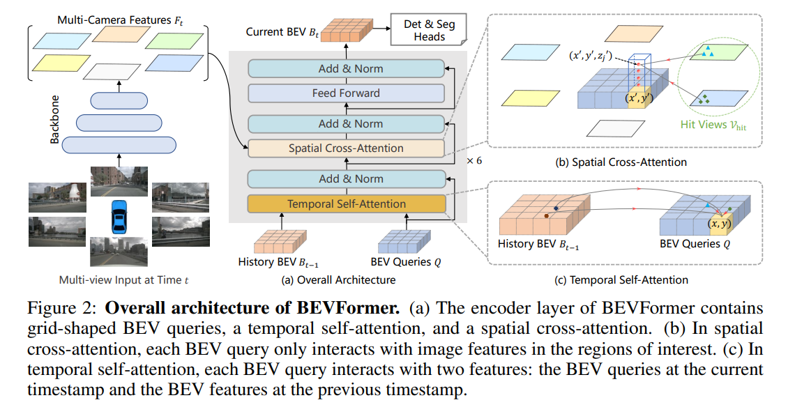

<div align="center">   
  
# BEVFormer: a Cutting-edge Baseline for Camera-based Detection
</div>


https://user-images.githubusercontent.com/27915819/161392594-fc0082f7-5c37-4919-830a-2dd423c1d025.mp4

> **BEVFormer: Learning Bird's-Eye-View Representation from Multi-Camera Images via Spatiotemporal Transformers**, ECCV 2022
> - [Paper in arXiv](http://arxiv.org/abs/2203.17270) | [Paper in Chinese](https://drive.google.com/file/d/1dKnD6gUHhBXZ8gT733cIU_A7dHEEzNTP/view?usp=sharing) |  [OpenDriveLab](https://opendrivelab.com/)
> - [Slides in English](https://docs.google.com/presentation/d/1fTjuSKpj_-KRjUACr8o5TbKetAXlWrmpaorVvfCTZUA/edit?usp=sharing) | [Occupancy and BEV Perception Talk Slides](https://docs.google.com/presentation/d/1U7wVi2_zJxM-EMqLVqC4zJ12ItUgS7ZcsXp7zQ1fkvc/edit?usp=sharing)
> -  [Blog in Chinese](https://www.zhihu.com/question/521842610/answer/2431585901) | [Video Talk](https://www.bilibili.com/video/BV12t4y1t7Lq?share_source=copy_web) and [Slides](https://docs.google.com/presentation/d/1NNeikhDPkgT14G1D_Ih7K3wbSN0DkvhO9wlAMx3CIcM/edit?usp=sharing) (in Chinese) 
> - [BEV Perception Survey](https://arxiv.org/abs/2209.05324) (Accepted by PAMI) | [Github repo](https://github.com/OpenDriveLab/BEVPerception-Survey-Recipe)


# News
- [2022/6/16]: We added two BEVformer configurations, which require less GPU memory than the base version. Please pull this repo to obtain the latest codes.
- [2022/6/13]: We release an initial version of BEVFormer. It achieves a baseline result of **51.7%** NDS on nuScenes.
- [2022/5/23]: 🚀🚀Built on top of BEVFormer, **BEVFormer++**, gathering up all best practices in recent SOTAs and our unique modification,  ranks **1st** on [Waymo Open Datast 3D Camera-Only Detection Challenge](https://waymo.com/open/challenges/2022/3d-camera-only-detection/). We will present BEVFormer++ on CVPR 2022 Autonomous Driving [Workshop](https://cvpr2022.wad.vision/).
- [2022/3/10]: 🚀BEVFormer achieve the SOTA on [nuScenes Detection Task](https://nuscenes.org/object-detection?externalData=all&mapData=all&modalities=Camera) with **56.9% NDS** (camera-only)!
</br>


# Abstract
In this work, the authors present a new framework termed BEVFormer, which learns unified BEV representations with spatiotemporal transformers to support multiple autonomous driving perception tasks. In a nutshell, BEVFormer exploits both spatial and temporal information by interacting with spatial and temporal space through predefined grid-shaped BEV queries. To aggregate spatial information, the authors design a spatial cross-attention that each BEV query extracts the spatial features from the regions of interest across camera views. For temporal information, the authors propose a temporal self-attention to recurrently fuse the history BEV information.
The proposed approach achieves the new state-of-the-art **56.9\%** in terms of NDS metric on the nuScenes test set, which is **9.0** points higher than previous best arts and on par with the performance of LiDAR-based baselines.


# Methods



# Getting Started
- [Installation](docs/install.md) 
- [Prepare Dataset](docs/prepare_dataset.md)
- [Run and Eval](docs/getting_started.md)

# Model Zoo

| Backbone | Method | Lr Schd | NDS| mAP|memroy | Config | Download |
| :---: | :---: | :---: | :---: | :---:|:---:| :---: | :---: |
| R50 | BEVFormer-tiny_fp16 | 24ep | 35.9|25.7 | - |[config](projects/configs/bevformer_fp16/bevformer_tiny_fp16.py) |[model](https://github.com/zhiqi-li/storage/releases/download/v1.0/bevformer_tiny_fp16_epoch_24.pth)/[log](https://github.com/zhiqi-li/storage/releases/download/v1.0/bevformer_tiny_fp16_epoch_24.log) |
| R50 | BEVFormer-tiny | 24ep | 35.4|25.2 | 6500M |[config](projects/configs/bevformer/bevformer_tiny.py) |[model](https://github.com/zhiqi-li/storage/releases/download/v1.0/bevformer_tiny_epoch_24.pth)/[log](https://github.com/zhiqi-li/storage/releases/download/v1.0/bevformer_tiny_epoch_24.log) |
| [R101-DCN](https://github.com/zhiqi-li/storage/releases/download/v1.0/r101_dcn_fcos3d_pretrain.pth)  | BEVFormer-small | 24ep | 47.9|37.0 | 10500M |[config](projects/configs/bevformer/bevformer_small.py) |[model](https://github.com/zhiqi-li/storage/releases/download/v1.0/bevformer_small_epoch_24.pth)/[log](https://github.com/zhiqi-li/storage/releases/download/v1.0/bevformer_small_epoch_24.log) |
| [R101-DCN](https://github.com/zhiqi-li/storage/releases/download/v1.0/r101_dcn_fcos3d_pretrain.pth)  | BEVFormer-base | 24ep | 51.7|41.6 |28500M |[config](projects/configs/bevformer/bevformer_base.py) | [model](https://github.com/zhiqi-li/storage/releases/download/v1.0/bevformer_r101_dcn_24ep.pth)/[log](https://github.com/zhiqi-li/storage/releases/download/v1.0/bevformer_r101_dcn_24ep.log) |
| [R50](https://pan.baidu.com/s/1Jh5Aq2YwcD6tdj7Sl5BB3g?pwd=5rij)  | BEVformerV2-t1-base | 24ep | 42.6 | 35.1 | 23952M |[config](projects/configs/bevformerv2/bevformerv2-r50-t1-base-24ep.py) | [model/log](https://pan.baidu.com/s/1ynzlAt1DQbH8NkqmisatTw?pwd=fdcv) |
| [R50](https://pan.baidu.com/s/1Jh5Aq2YwcD6tdj7Sl5BB3g?pwd=5rij)  | BEVformerV2-t1-base | 48ep | 43.9 | 35.9 | 23952M |[config](projects/configs/bevformerv2/bevformerv2-r50-t1-base-48ep.py) | [model/log](https://pan.baidu.com/s/1ynzlAt1DQbH8NkqmisatTw?pwd=fdcv) |
| [R50](https://pan.baidu.com/s/1Jh5Aq2YwcD6tdj7Sl5BB3g?pwd=5rij)  | BEVformerV2-t1 | 24ep | 45.3 | 38.1 | 37579M |[config](projects/configs/bevformerv2/bevformerv2-r50-t1-24ep.py) | [model/log](https://pan.baidu.com/s/1ynzlAt1DQbH8NkqmisatTw?pwd=fdcv) |
| [R50](https://pan.baidu.com/s/1Jh5Aq2YwcD6tdj7Sl5BB3g?pwd=5rij)  | BEVformerV2-t1 | 48ep | 46.5 | 39.5 | 37579M |[config](projects/configs/bevformerv2/bevformerv2-r50-t1-48ep.py) | [model/log](https://pan.baidu.com/s/1ynzlAt1DQbH8NkqmisatTw?pwd=fdcv) |
| [R50](https://pan.baidu.com/s/1Jh5Aq2YwcD6tdj7Sl5BB3g?pwd=5rij)  | BEVformerV2-t2 | 24ep | 51.8 | 42.0 | 38954M |[config](projects/configs/bevformerv2/bevformerv2-r50-t2-24ep.py) | [model/log](https://pan.baidu.com/s/1ynzlAt1DQbH8NkqmisatTw?pwd=fdcv) |
| [R50](https://pan.baidu.com/s/1Jh5Aq2YwcD6tdj7Sl5BB3g?pwd=5rij)  | BEVformerV2-t2 | 48ep | 52.6 | 43.1 | 38954M |[config](projects/configs/bevformerv2/bevformerv2-r50-t2-48ep.py) | [model/log](https://pan.baidu.com/s/1ynzlAt1DQbH8NkqmisatTw?pwd=fdcv) |
| [R50](https://pan.baidu.com/s/1Jh5Aq2YwcD6tdj7Sl5BB3g?pwd=5rij)  | BEVformerV2-t8 | 24ep | 55.3 | 46.0 | 40392M |[config](projects/configs/bevformerv2/bevformerv2-r50-t8-24ep.py) | [model/log](https://pan.baidu.com/s/1ynzlAt1DQbH8NkqmisatTw?pwd=fdcv) |

# Catalog
- [ ] BEVFormerV2 HyperQuery
- [ ] BEVFormerV2 Optimization, including memory, speed, inference.
- [x] BEVFormerV2 Release
- [ ] BEV Segmentation checkpoints
- [ ] BEV Segmentation code
- [x] 3D Detection checkpoints
- [x] 3D Detection code
- [x] Initialization


# Bibtex
If this work is helpful for your research, please consider citing the following BibTeX entry.

```
@article{li2022bevformer,
  title={BEVFormer: Learning Bird’s-Eye-View Representation from Multi-Camera Images via Spatiotemporal Transformers},
  author={Li, Zhiqi and Wang, Wenhai and Li, Hongyang and Xie, Enze and Sima, Chonghao and Lu, Tong and Qiao, Yu and Dai, Jifeng}
  journal={arXiv preprint arXiv:2203.17270},
  year={2022}
}
@article{Yang2022BEVFormerVA,
  title={BEVFormer v2: Adapting Modern Image Backbones to Bird's-Eye-View Recognition via Perspective Supervision},
  author={Chenyu Yang and Yuntao Chen and Haofei Tian and Chenxin Tao and Xizhou Zhu and Zhaoxiang Zhang and Gao Huang and Hongyang Li and Y. Qiao and Lewei Lu and Jie Zhou and Jifeng Dai},
  journal={ArXiv},
  year={2022},
}
```

# Acknowledgement

Many thanks to these excellent open source projects:
- [dd3d](https://github.com/TRI-ML/dd3d) 
- [detr3d](https://github.com/WangYueFt/detr3d) 
- [mmdet3d](https://github.com/open-mmlab/mmdetection3d)


### &#8627; Stargazers
[](https://github.com/fundamentalvision/BEVFormer/stargazers)

### &#8627; Forkers
[](https://github.com/fundamentalvision/BEVFormer/network/members)

